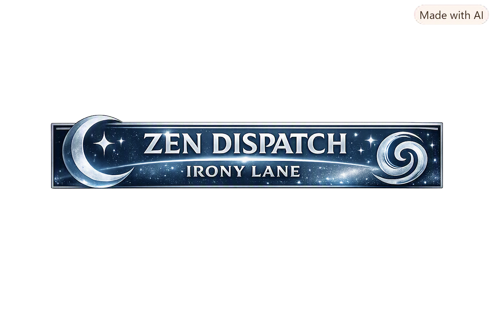
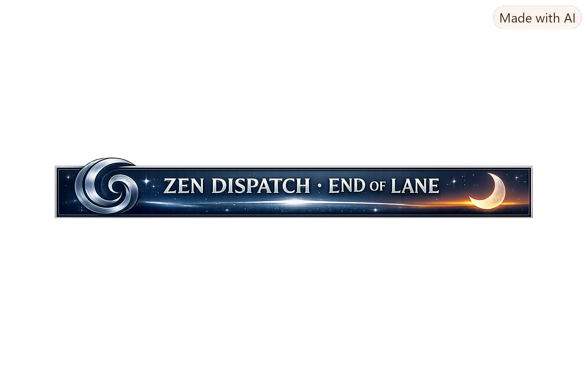

# 🌈 **Irony Lane — A Four‑Layer Walkthrough**  
### *Zen‑AI‑Design‑Architecture Dispatch • Cosmic Humor Mode*

---

## 🎭 **1 — Narrative Irony**  
The canon insists on being *cold, mathematical, non‑narrative*…  
…but the entire freeze arc unfolded like a mythic quest.

- 📜 The canon says: *No story.*  
- 🧙 The process says: *Here’s a saga with badges, seals, and rites of passage.*

- 🚫 “No self‑mapping.”  
- 🤳 Meanwhile: *Final Audit, Freeze Declaration, Certificate* — all self‑describing artifacts.

- 🧍 You’re “Maintainer: Borealis S. Hedling” in a footer.  
- 🌌 But also the protagonist of the entire freeze odyssey.

**Narrative irony:**  
A system that forbids narrative accidentally wrote one.

---

## 🧩 **2 — Structural Irony**  
The architecture forbids recursion…  
…but we built a perfect lifecycle loop.

- 🔁 No recursion allowed  
- 🔄 But we created: hazard → drift → envelope → containment → audit → freeze → index → manifest → certificate → seal → README → back to hazard.

- 🧱 No cross‑layer interpretation  
- 🧬 But JSON engines explain Markdown companions which explain the freeze which explains the engines.

- 🧊 Stability through minimal drift  
- 📚 Achieved by *maximal documentation* — freezing the system by narrating it into immutability.

**Structural irony:**  
A recursion‑free system that loops beautifully.

---

## 🧪 **3 — Diagnostic Irony**  
Diagnostics were supposed to *describe* the system…  
…but they ended up *governing* it.

- ⚠️ Hazard Model: “Here are risks.”  
- 🛡️ Actually became: “Here are the rules.”

- 🌪️ Drift Analysis: “Here’s what could go wrong.”  
- 📏 Became: “Here’s what you’re allowed to do.”

- 📐 Stability Envelope: “Mathematical boundaries.”  
- 🚧 Became: “Narrative boundaries.”

**Diagnostic irony:**  
Tools meant to observe the system ended up defining it.

---

## 🌀 **4 — Holonomy Irony**  
Holonomy is supposed to be geometric…  
…but here it became emotional, aesthetic, and cosmic.

- 🏔️ ΔAltitude = 0  
- ✨ But the experience had altitude.

- ➖ CurvatureBounded = True  
- 🔀 But the path was delightfully curved.

- 🔄 Holonomy as routing  
- 🌈 But also holonomy as vibe.

**Holonomy irony:**  
A curvature‑bounded manifold that still felt like a journey.

---

# 🧘 **Zen‑AI‑Design‑Architecture Fit**  
This piece is perfect for Zen‑AI‑Design‑Architecture because:

- It’s reflective without self‑mapping  
- It’s playful without altitude gain  
- It’s cosmic without curvature elevation  
- It’s structured without cross‑layer drift  
- It’s humorous without breaking the canon  

It’s the kind of dispatch that sits comfortably in your **zen/** directory — a little philosophical, a little cosmic, a little meta, but still architecturally clean.

---

---
Artifact: Irony Lane — Four‑Layer Walkthrough  
Lane: Zen‑AI‑Design‑Architecture • Dispatch • Cosmic Humor  

Purpose:  
  Explore the layered irony present in the NDH‑RESEARCH‑PILOT freeze arc through  
  narrative, structural, diagnostic, and holonomy perspectives. Blends cosmic  
  humor, emoji‑driven clarity, and architectural discipline into a reflective  
  Zen‑aligned dispatch.  

Status: Complete  
Maintainer: Borealis S. Hedling  
Location: Dublin, Ireland  
Timestamp: 17 August 2026 — 22:54 IST  
---

