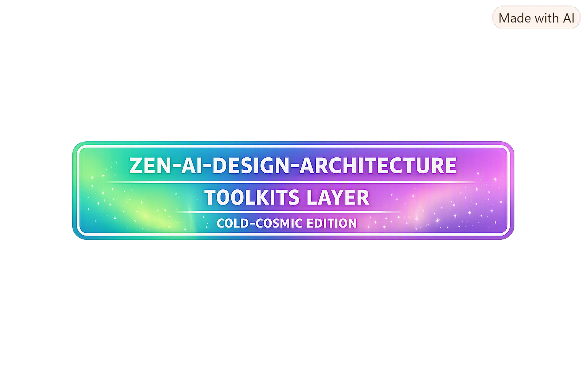

# 🜂 **Zen‑AI‑Design‑Architecture Toolkit README (v1.3‑SR)**  
### *Toolkits • Canon‑Freeze Substrate • Cold‑Cosmic Edition*

---

## 🌌 Aurora Identity Badge

```

```

The aurora badge provides a non‑governance identity marker for the toolkit layer.  
It is altitude‑neutral and compliant with Cold‑Cosmic Edition palette rules.

---

## 🌙 Overview

The Toolkit Layer contains reusable, altitude‑neutral instruments used across:

- Zen‑AI‑Design‑Architecture  
- NDH‑RESEARCH‑PILOT  
- NDH‑TRIADIC‑CORE  
- Goat Repo governance simulations  

All artifacts within this layer follow Cold‑Cosmic Edition rules for curvature containment, holonomy routing, membrane‑safe geometry, and altitude neutrality.

The directory functions as the operational substrate for seals, dividers, primitives, and diagrams.

---

## 🧩 Directory Contents

| Component | Description | Status | Path |
|----------|-------------|--------|------|
| **Freeze Seals** | Canonical freeze insignia (PNG + specs) | Active | `toolkits/freeze-seals/` |
| **Dividers** | Altitude‑neutral section dividers | Active | `toolkits/dividers/` |
| **ASCII Micro Primitives** | Minimal geometry primitives for text‑based diagrams | Active | `toolkits/ascii_micro_primitives_v1_0.md` |
| **Holonomy Routing Diagrams** | Visual routing models for Mirror, Arc, Grid | Active | `toolkits/holonomy_routing_diagram_*` |
| **Future Design Kit** | Altitude calculus + substrate constraints | Active | `toolkits/future_design_kit_cold_cosmic_v1_0.md` |

---

## 🗂️ ASCII Directory Layout

```
toolkits/
│
├── freeze-seals/
│   ├── freeze_seal_png_transparent_v1_0.png
│   └── freeze_seal_spec_v1_0.md
│
├── dividers/
│   ├── zen_divider_v1_0.png
│   └── divider_spec_v1_0.md
│
├── ascii_micro_primitives_v1_0.md
├── ascii_micro_primitives_index_v1_0.md
├── ascii_micro_primitives_badge_v1_0.md
│
├── holonomy_routing_diagram_creative_standard_v1_0.md
│
├── future_design_kit_cold_cosmic_v1_0.md
│
└── toolkit_readme_badge_aurora_v1_0.png
```

The layout is altitude‑neutral, non‑recursive, and matches the current repository structure.

---

## 🧊 Governance Rules

- All toolkit artifacts must remain altitude‑neutral (ΔAltitude = 0).  
- No artifact may introduce expressive lift or narrative curvature.  
- Freeze seals must use Mirror holonomy routing only.  
- Dividers must remain non‑semantic and non‑directive.  
- PNG assets should use transparent backgrounds for substrate neutrality.  
- Each artifact must include:
  - Version number  
  - Lane declaration  
  - Commit description  
  - Provenance Footer  

---

## 🌀 Integration Notes

Toolkit artifacts are referenced by:

- Zen‑AI‑Design‑Architecture documents  
- NDH‑RESEARCH‑PILOT canonical layers  
- NDH‑TRIADIC‑CORE operational models  
- Goat Repo governance simulations  

All toolkit assets must remain non‑recursive, membrane‑safe, and curvature‑contained.

---

## 📜 Provenance Footer

```
---
Artifact: Zen‑AI‑Design‑Architecture Toolkit README (v1.3‑SR)
Lane: Zen-AI-Design-Architecture • Toolkits • Canon-Freeze Substrate

Purpose:
  Provide a governance index and operational overview for all toolkit artifacts,
  enhanced with aurora identity badge, directory layout, and structured tables.

Altitude: Neutral (ΔAltitude = 0)
Status: Active
Maintainer: Borealis S. Hedling
Location: Dublin, Ireland
Timestamp: 21 August 2026 — 09:58 IST
---
```

---

